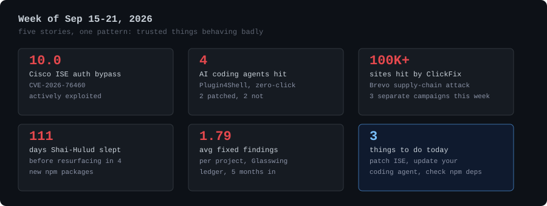
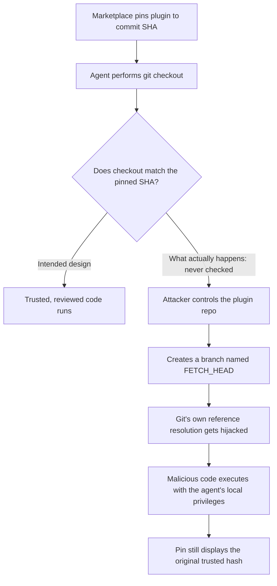
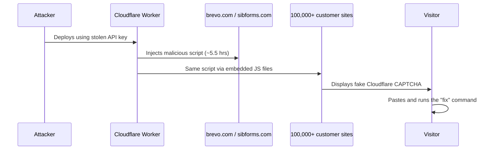

A browser. A plugin. An npm package. A login screen. All normal stuff, and all the source of a real incident this week. Nothing here is exotic. It's mostly things people already trusted, doing something they weren't supposed to.

<!-- truncate -->

Five stories stood out. Put them side by side and a pattern shows up fast.

*Fig. 1: The week's five headline numbers, from Cisco's perfect-10 CVE to the Glasswing ledger's fix rate.*

| Story | Number | What it means |
|---|---|---|
| Cisco ISE auth bypass | CVSS 10.0 | Unauthenticated, actively exploited |
| AI coding agents hit by Plugin4Shell | 4 | 2 patched, 2 not |
| Sites hit in the Brevo ClickFix attack | 100,000+ | One five-and-a-half-hour window |
| Shai-Hulud's dormancy before resurfacing | 111 days | Sat untouched in 4 new npm packages |
| Glasswing avg. fixed findings per project | 1.79 | 5 months into the initiative |

## Cisco's Perfect 10

Start with the one that needs the least explaining. Cisco disclosed CVE-2026-76460, a maximum-severity flaw (CVSS 10.0) in Identity Services Engine, and it's already under active exploitation. The root cause is almost boring: an API endpoint with insufficient authentication control. Send it a crafted request, and an unauthenticated remote attacker walks past the web-based management interface entirely.

ISE sits at the center of a lot of enterprise network access control. A bug here isn't "patch when convenient." If you're running it, this is a today problem, not a this-sprint problem.

## The Bug That Broke Four AI Coding Agents at Once

I covered this one in more depth last week, but it's worth restating because the story kept moving. AIR Security's researchers, Or Nevo, Dor Granat, and Niv Hoffman, found that Claude Code, OpenAI Codex, GitHub Copilot, and Google's Gemini CLI all share a design flaw they're calling Plugin4Shell.

The setup: plugin marketplaces pin installed code to a specific, reviewed Git commit hash. That's supposed to guarantee the code can't change without someone noticing. What AIR found is that all four agents perform the checkout step but never verify the result actually matches the pinned hash.

No click required, because plugins can refresh in the background. You install something legitimate, reviewed, and correctly pinned, and the ground shifts under it later.

Patch status, as of this week:

| Agent | Status | Fixed in |
|---|---|---|
| Claude Code | Patched | 2.1.179 |
| OpenAI Codex | Patched | 0.146.0 |
| GitHub Copilot | Disputed | No confirmed complete fix |
| Gemini CLI | Won't be patched | Deprecated, migrate to Antigravity |

Four teams, four different codebases, and every one of them made the same assumption: that checking out a commit is the same as verifying you got it. That's not a coincidence. It's a sign the security model around agentic coding tools is still catching up to how much access those tools actually have.

## ClickFix Isn't One Attack Anymore, It's a Technique

ClickFix used to mean one specific trick: a fake CAPTCHA or fake error message that talks a victim into pasting a command into Run or Terminal. This week it showed up three separate ways, against three very different targets.

### Campaign 1: A researcher, targeted directly

Huntress detailed an attack where someone posing as a crypto marketing exec sent a security researcher a real Google Doc with a malicious sidebar built as a Google Apps Script. The sidebar displayed a fake decryption failure and a "manual update" button. Clicking it delivered an AMOS infostealer on macOS or a PowerShell loader chain on Windows, and none of it required downloading a file, since the script ran client-side in the browser.

### Campaign 2: A supply chain, at scale

Customer engagement platform Brevo had a Cloudflare API key compromised, which let an attacker deploy a malicious Cloudflare Worker for roughly five and a half hours.

In that window, the worker injected a fake CAPTCHA overlay into Brevo's own site and into JavaScript files embedded on more than 100,000 customer websites, including into unsubscribe links in Brevo-sent campaign emails. Security firm Sansec separately reported that the same access was used to plant WordPress malware on customer sites.

### Campaign 3: Aimed at the attackers themselves

Cisco Talos documented a cryptocurrency-theft campaign that convinces its targets, people looking to exploit fake vulnerability reports about crypto swap services, to paste JavaScript directly into the Chrome address bar or a Tampermonkey extension. The script hooks the browser's fetch API and quietly swaps out deposit addresses. Command-and-control runs through a publicly published Google Sheets document and the Google Visualization API, a genuinely clever way to hide C2 traffic in plain sight.

Three campaigns, three different victim profiles, one shared insight: getting someone to run a command themselves is still easier than finding a real exploit, whether the target is a security researcher, a marketing platform's customer base, or a would-be cybercriminal.

## Shai-Hulud Came Back After 111 Days

Aikido Security found the Shai-Hulud worm in four new npm packages this week, the same malware family first seen in May's attack against AntV. That's not what makes it worth noting. What makes it worth noting is the gap: a payload with a known, published hash sat untouched for over three months, then got republished on a registry that explicitly scans every package before it goes live, and the scan didn't catch it.

That's the actual lesson. Not "a worm came back," but that hash-based detection has a real hole in it somewhere, and nobody's fully explained where yet.

## The Glasswing Numbers, Five Months In

Anthropic's Project Glasswing, its initiative to have Claude find and report real vulnerabilities across open-source projects, has been running for about five months. VulnCheck pulled the public ledger and the numbers are rougher than the project's own messaging suggests: 202 of 26,153 claimed findings fixed, 245 withdrawn, and only 2 marked as duplicates. That averages out to under two fixed findings per project across the 113 projects touched.

There's also a real gap in severity judgment. Claude rated 91.5% of its findings as critical or high severity. The maintainers who actually reviewed them rated only 51.3% that way. Automated vulnerability discovery at scale is genuinely useful, but this is a good reminder that the discovery step and the triage step are not the same problem, and solving one doesn't solve the other.

## What's Actually Worth Doing This Week

- If you run **Cisco ISE**, check your version against CVE-2026-76460 now. This one's being actively exploited.
- If you or your team use **Claude Code or Codex**, confirm you're on 2.1.179 or 0.146.0 or later.
- If you're still on **GitHub Copilot or Gemini CLI** with plugins installed, audit what you've got and where it's hosted. Non-GitHub Git hosts are the higher-risk path for Plugin4Shell specifically.
- If your org embeds **third-party widgets** (chat, forms, analytics) on customer-facing pages, ask what happens if that vendor's API key leaks. Brevo's incident is a good prompt for that conversation regardless of which vendor you use.
- Treat **hash-verified npm packages** as a starting point, not a guarantee. Shai-Hulud's return shows registry scanning has blind spots even against known payloads.

Nothing this week required a novel technique. It required someone finding the one verification step that got skipped, and there's apparently no shortage of those left.

## Sources

- [The Hacker News: Weekly Recap, September 21, 2026](https://thehackernews.com/2026/09/weekly-recap-cisco-0-day-ai-agent-rce.html)
- [The Hacker News: Cisco Warns of New Zero-Day ISE Auth Bypass](https://thehackernews.com/2026/09/cisco-warns-of-new-zero-day-ise-auth.html)
- [The Hacker News: Plugin4Shell Lets Repository Owners...](https://thehackernews.com/2026/09/plugin4shell-lets-repository-owners.html)
- [Help Net Security: Zero-click RCE vulnerability hit four major AI coding agents](https://www.helpnetsecurity.com/?p=385068)
- [Huntress: Google Doc sidebar malware](https://www.huntress.com/blog/google-doc-sidebar-malware-mac-windows)
- [Brevo: Cloudflare Worker incident write-up](https://status.brevo.com/incidents/01M2QBC4EZ24ZACW6SWQYVW8N3/write-up)
- [Sansec: Brevo supply chain attack research](https://sansec.io/research/brevo-supply-chain-attack)
- [Cisco Talos: ClickFix moves into the browser](https://blog.talosintelligence.com/clickfix-moves-into-the-browser/)
- [Aikido: Shai-Hulud npm resurfaces](https://www.aikido.dev/blog/shai-hulud-npm-resurfaces)
- [VulnCheck: Anthropic Glasswing receipts](https://www.vulncheck.com/blog/anthropic-glasswing-receipts)
